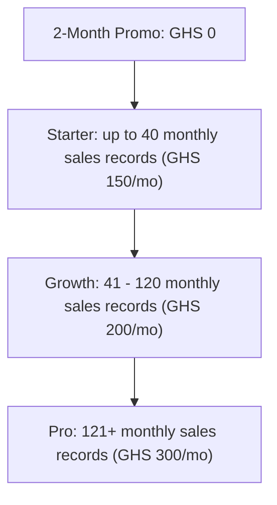

# BatchCommerce: Pricing Model Proposal & Strategy

This document outlines the potential pricing strategies for the BatchCommerce platform. It evaluates three traditional models, identifies tenant-specific behaviors (WhatsApp pre-order commerce), and presents a recommended hybrid strategy.

---

## 📊 Summary of Evaluated Models

| Pricing Model | Pros | Cons | Feasibility & Bypass Risk |
| :--- | :--- | :--- | :--- |
| **1. Flat Monthly Fee** | Predictable revenue, simple billing, encouraging high usage. | Barrier to entry for beginners, mismatch between small vs. large sellers. | **High Feasibility.** Zero friction, but limits monetization of high-value power users. |
| **2. Charge Per Order** | Low onboarding friction, aligns price with operations volume. | Encourages merchants to "merge" orders or process offline to avoid limits. | **Medium Feasibility.** Fair, but metered limits create user-facing friction. |
| **3. Percentage Fee** | Direct alignment with transaction volume; highly scalable. | Highest transaction friction; impossible to enforce without standard online gateways. | **Low Feasibility / High Bypass Risk.** Merchants will under-report values to avoid the fee. |

---

## 🔍 Detailed Model Analysis

### 1. Flat Monthly Fee (SaaS Subscription)
* **Overview:** A predictable recurring subscription (e.g., GHS 150 / $15 per month).
* **Merchant Impact:** Highly predictable. They know exactly how much they spend each month. Encourages them to utilize the platform for all products, clients, and pre-orders.
* **Platform Impact:** Predictable Monthly Recurring Revenue (MRR) and simple subscription management.
* **Why it's not perfect:** Very small merchants (who do 5-10 orders a month) will find it too expensive, while large merchants (doing 2,000+ orders) get massive value for almost nothing.

### 2. Pay-per-Order processed (Usage-Based)
* **Overview:** Charging a small fee per order (e.g., $0.10 per order) or purchasing pre-paid order blocks.
* **Merchant Impact:** Low risk. If a merchant has a slow month with no batches running, they pay next to nothing.
* **Platform Impact:** Aligns with backend transaction loads and value delivered.
* **Why it's not perfect:** Metred pricing introduces "usage anxiety." Merchants might start writing down details on paper or WhatsApp notes for small customers to avoid trigger counts, reducing platform reliance.

### 3. Percentage Commission (Transaction Cut)
* **Overview:** Taking a percentage of the total transaction amount (e.g., 1.5% of order values).
* **Merchant Impact:** Feels like a direct tax on sales.
* **Why this is highly vulnerable in BatchCommerce:**
  > [!WARNING]
  > **The Payment Scoping Flaw (Bypass Risk):**
  > BatchCommerce processes payments manually (Cash, Mobile Money transfers, and manual ledger entries). Because the software does not control the actual payment gateway (like Stripe or Paystack), you cannot automatically deduct commissions.
  > If you charge a percentage fee, merchants will simply input lower prices, report incorrect totals, or bypass recording orders on the system entirely. It compromises your data consistency and tenant trust.

---

## 🏆 Recommended Strategy: Paid Tiers With A 2-Month New-User Promo

To capture value from serious merchants, avoid a permanent free-support burden, and still give new users enough time to trust the system, we recommend a **paid tiered subscription** with a **2-month free promotional period for new shop owners**.

The pricing meter should be based on **monthly sales records**, not only preorder orders.

A monthly sales record includes:

* A preorder/customer order created in `orders`.
* A direct stock sale created in `stock_sales`.

A monthly sales record does **not** include:

* Order items or stock-sale line items.
* Buying list rows.
* Arrival rows.
* Shipping, delivery, tracking, or ledger rows.
* Products, clients, roles, or staff records.

This matters because Stock Sales is part of the real merchant workflow. If only preorder orders count, merchants could use Stock Sales as an unintended pricing loophole.

### Promo Rule

New users get **2 months free** after signup or shop activation. After the promo expires, the shop must be on one of the paid tiers below.

Recommended promo guardrails:

* The promo should be one-time per shop owner/business identity.
* Each owner account should be allowed to create only one shop, enforced in both the app bootstrap flow and the database.
* A generated browser/device ID should be captured during shop creation as a secondary promo-abuse signal. This is useful for obvious repeat signups on the same device, but it should not be treated as the only guard because users can clear browser storage or use another device.
* The promo should show clear expiry messaging inside the app before it ends.
* During the promo, users can experience the full operational workflow, but the app should still track usage so the correct recommended tier is visible before billing starts.

### Promo Codes

Promo codes support targeted campaigns without changing the base pricing model. A code can:

* Extend a shop's promo window by a configured number of days.
* Record a discount percentage for the future billing/admin workflow.
* Optionally move a shop to a specific plan band.
* Enforce expiry dates, max redemptions, and one redemption per shop.

For now, promo-code creation is intentionally database/admin-managed. A public in-app creation screen should wait until there is a secure platform-admin surface, because promo codes are global commercial controls rather than normal shop settings.

### Proposed 3-Tier Paid Model

Best for simplicity, clear positioning, and avoiding decision anxiety.

1. **Starter**
   * **Band:** Up to 40 monthly sales records.
   * **Price:** **GHS 150 / month**.
   * **Best for:** Smaller sellers who need structure, receipts, inventory visibility, and customer history.
   * **Features:** Core preorder, stock sales, products, clients, receipts, and basic reports.
2. **Growth**
   * **Band:** 41 - 120 monthly sales records.
   * **Price:** **GHS 200 / month**.
   * **Best for:** Active sellers running regular drops or combining preorder and in-stock selling.
   * **Features:** Everything in Starter, plus stronger reporting, exports, and operational workflow tools.
3. **Pro**
   * **Band:** 121+ monthly sales records.
   * **Price:** **GHS 300 / month**.
   * **Best for:** High-volume sellers, importers, and teams with staff managing orders, stock, shipping, and deliveries.
   * **Features:** Everything in Growth, plus staff/RBAC, advanced controls, custom receipt options, and priority support.

---

## 💡 Why This Hybrid Model Works Best

1. **Eliminates Billing Bypass:** Because merchants pay a flat tier, they do not pay a percentage of transaction value. They have less incentive to falsify order prices or payments in the system.
2. **Includes The Full Sales Workflow:** Counting both preorder orders and stock sales makes the pricing model match how merchants actually use BatchCommerce.
3. **Avoids Permanent Free-Tier Drag:** The 2-month promo lowers onboarding friction without creating a long-term pool of free users who still need support and infrastructure.
4. **Flexible With Seasonality:** Social commerce is seasonal. Shops can move between Starter, Growth, and Pro as their monthly sales-record volume changes.
5. **Feature Upselling:** Beyond volume limits, advanced features such as staff accounts, RBAC, custom receipts, exports, advanced reports, and operational controls can push serious operators naturally into higher tiers.

---

## Implementation Notes

The first implementation should enforce plan usage before payment automation is added:

* Store plan and promo state on `shops`.
* Count monthly sales records from `orders` plus `stock_sales`.
* Allow sales-record creation during the active 2-month promo.
* After promo expiry, require `subscription_status = 'active'`.
* Require an active subscription after promo expiry before creating new sales records.
* Allow paid shops to create overages instead of blocking sales operations.
* Show current plan, promo status, monthly usage, overages, and recommended tier in Settings and Subscription.
* Let shops redeem promo codes through a guarded database RPC, with redemption history tracked per shop.

Payment collection and admin plan-management are separate follow-up work. Until those exist, plan activation can be managed directly in Supabase by updating the shop's `subscription_plan` and `subscription_status`.
