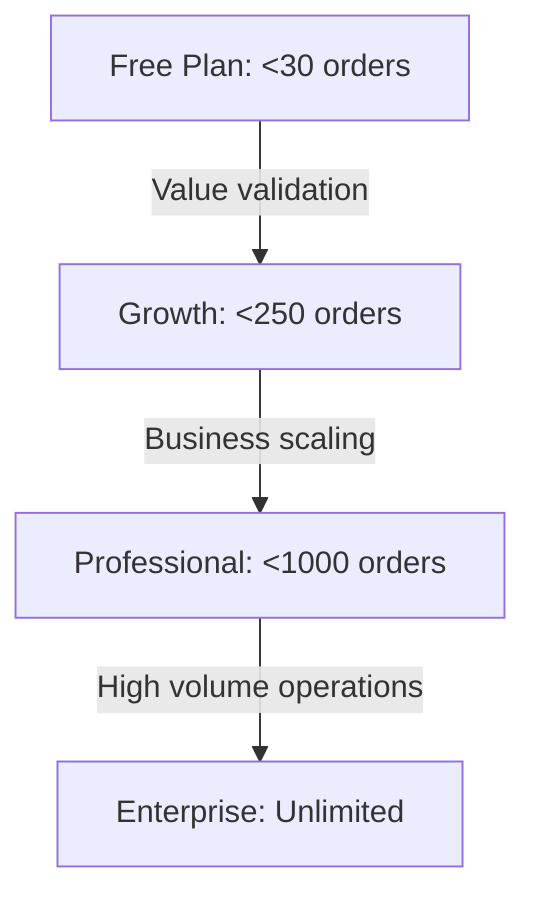

# BatchCommerce: Pricing Model Proposal & Strategy

This document outlines the potential pricing strategies for the BatchCommerce platform. It evaluates three traditional models, identifies tenant-specific behaviors (WhatsApp pre-order commerce), and presents a recommended hybrid strategy.

---

## 📊 Summary of Evaluated Models

| Pricing Model | Pros | Cons | Feasibility & Bypass Risk |
| :--- | :--- | :--- | :--- |
| **1. Flat Monthly Fee** | Predictable revenue, simple billing, encouraging high usage. | Barrier to entry for beginners, mismatch between small vs. large sellers. | **High Feasibility.** Zero friction, but limits monetization of high-value power users. |
| **2. Charge Per Order** | Low onboarding friction, aligns price with operations volume. | Encourages merchants to "merge" orders or process offline to avoid limits. | **Medium Feasibility.** Fair, but metered limits create user-facing friction. |
| **3. Percentage Fee** | Direct alignment with transaction volume; highly scalable. | Highest transaction friction; impossible to enforce without standard online gateways. | **Low Feasibility / High Bypass Risk.** Merchants will under-report values to avoid the fee. |

---

## 🔍 Detailed Model Analysis

### 1. Flat Monthly Fee (SaaS Subscription)
* **Overview:** A predictable recurring subscription (e.g., GHS 150 / $15 per month).
* **Merchant Impact:** Highly predictable. They know exactly how much they spend each month. Encourages them to utilize the platform for all products, clients, and pre-orders.
* **Platform Impact:** Predictable Monthly Recurring Revenue (MRR) and simple subscription management.
* **Why it's not perfect:** Very small merchants (who do 5-10 orders a month) will find it too expensive, while large merchants (doing 2,000+ orders) get massive value for almost nothing.

### 2. Pay-per-Order processed (Usage-Based)
* **Overview:** Charging a small fee per order (e.g., $0.10 per order) or purchasing pre-paid order blocks.
* **Merchant Impact:** Low risk. If a merchant has a slow month with no batches running, they pay next to nothing.
* **Platform Impact:** Aligns with backend transaction loads and value delivered.
* **Why it's not perfect:** Metred pricing introduces "usage anxiety." Merchants might start writing down details on paper or WhatsApp notes for small customers to avoid trigger counts, reducing platform reliance.

### 3. Percentage Commission (Transaction Cut)
* **Overview:** Taking a percentage of the total transaction amount (e.g., 1.5% of order values).
* **Merchant Impact:** Feels like a direct tax on sales.
* **Why this is highly vulnerable in BatchCommerce:**
  > [!WARNING]
  > **The Payment Scoping Flaw (Bypass Risk):**
  > BatchCommerce processes payments manually (Cash, Mobile Money transfers, and manual ledger entries). Because the software does not control the actual payment gateway (like Stripe or Paystack), you cannot automatically deduct commissions.
  > If you charge a percentage fee, merchants will simply input lower prices, report incorrect totals, or bypass recording orders on the system entirely. It compromises your data consistency and tenant trust.

---

## 🏆 Recommended Strategy: The Hybrid "Tiered Volume" Plan

To capture value from large operations, provide a risk-free onboarding path for beginners, and eliminate bypass risks, we recommend a **Flat-Fee Tiered Structure based on Monthly Order Volume**. 

This aligns pricing with value delivered (administrative overhead saved) while retaining SaaS predictability.

### Proposed Tiers & Pricing Structure

#### 1. Starter (Free Tier)
* **Limit:** Up to 30 orders/month.
* **Price:** **$0** (Free Forever).
* **Features:** Single shop setup, basic pre-order catalog, manual WhatsApp receipt tools.
* **Goal:** Zero barrier to entry. Validates the software for small sellers.

#### 2. Growth Tier
* **Limit:** Up to 250 orders/month.
* **Price:** **~$15 to $19 / month** (billed monthly or annually).
* **Features:** Multi-shop switching, standard inventory alerts, full sales analytics.
* **Goal:** Active merchants who run 1 to 2 pre-order batches monthly.

#### 3. Professional Tier
* **Limit:** Up to 1,000 orders/month.
* **Price:** **~$39 to $49 / month**.
* **Features:** Role-based access control (RBAC), staff account management, custom receipt templates, API hooks.
* **Goal:** Established import sellers and boutique storefronts with auxiliary staff.

#### 4. Enterprise / High-Volume Tier
* **Limit:** Unlimited orders.
* **Price:** **~$99+ / month**.
* **Features:** Multi-tenant staff permissions, dedicated support, custom domain tracking pages.
* **Goal:** High-volume wholesale importers.

---

## 💡 Why This Hybrid Model Works Best

1. **Eliminates Billing Bypass:** Because merchants pay a flat tier, they do not pay per transaction size. They have no incentive to falsify order prices or payments in the system.
2. **Flexible with Seasonality:** Social commerce is highly seasonal. By structuring tiers based on monthly volume, merchants can upgrade during active batch drops and safely downgrade to the free tier during quiet inventory periods.
3. **Features Upselling:** Beyond order limits, you can gate advanced system features (such as Role Management, Staff accounts, and multiple shop setups) to the paid tiers. Large organizations with staff are naturally pushed to the **Professional** tier.
